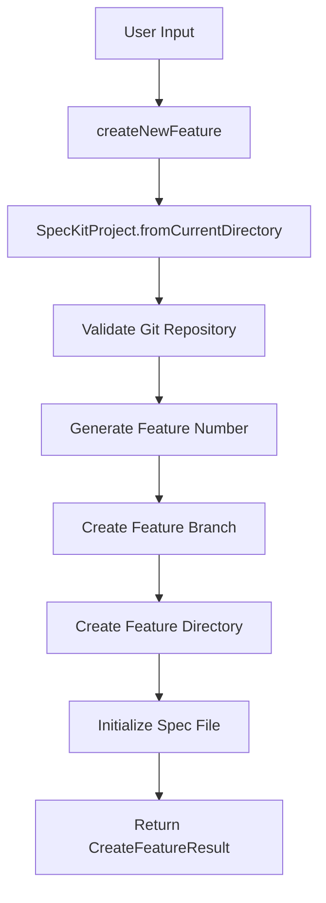
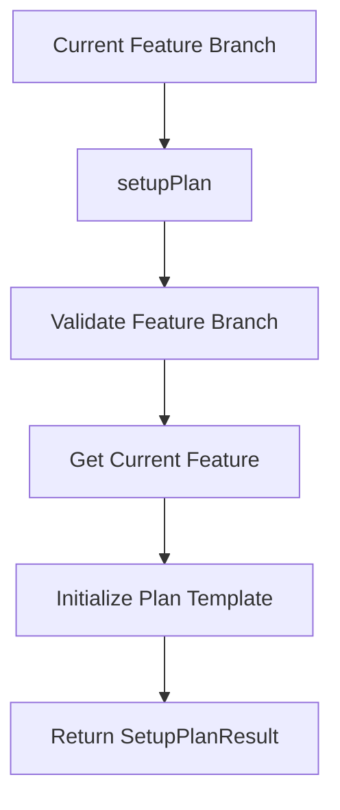

# Spec-Kit SDK Architecture

This document describes the architecture of the Spec-Kit SDK, a modern TypeScript implementation that maintains full compatibility with the original bash scripts.

## Overview

The Spec-Kit SDK is built as a monorepo using Turborepo and Bun, providing both programmatic TypeScript APIs and command-line interfaces while preserving the original spec-kit workflow and templates.

## Core Principles

1. **Backward Compatibility**: 100% compatibility with original bash scripts
2. **Type Safety**: Full TypeScript implementation with comprehensive type definitions
3. **Cross-Platform**: Works on Linux, macOS, and Windows
4. **Modularity**: Clean separation of concerns with well-defined interfaces
5. **Preservation**: Original `.specify/` directory and Claude commands remain unchanged

## Project Structure

```
spec-kit-sdk/
├── .specify/                    # ⚠️ PRESERVED - Original spec-kit files
│   ├── scripts/bash/           # Original bash scripts (now wrappers)
│   ├── templates/              # Document templates
│   ├── memory/                 # Constitutional requirements
│   └── ...                     # Other original spec-kit files
├── .claude/                    # ⚠️ PRESERVED - Claude-specific configurations
│   ├── commands/               # Claude command definitions
│   ├── agents/                 # Specialized agents
│   └── settings.json          # Claude settings
├── .github/                    # GitHub workflows and configs
├── packages/                   # Monorepo packages
│   ├── scripts/               # Main TypeScript implementation
│   └── tooling-config/        # Shared configuration
├── specs/                     # Generated feature specifications
├── memory/                    # Project memory and requirements
└── ...                        # Root configuration files
```

## Package Architecture: @spec-kit/scripts

The main TypeScript implementation is organized into several layers:

### 1. Contracts Layer (`src/contracts/`)

Defines all interfaces, types, and error classes:

```typescript
// Core interfaces
interface CreateFeatureResult { ... }
interface SetupPlanResult { ... }
interface FeaturePathsResult { ... }

// Error hierarchy
class SpecKitError extends Error { ... }
class FeatureBranchError extends SpecKitError { ... }
class FileOperationError extends SpecKitError { ... }
```

### 2. Utils Layer (`src/utils/`)

Low-level utilities for system operations:

- **FileOperations**: File system interactions
- **GitOperations**: Git repository management
- **PathUtilities**: Path resolution and validation

### 3. Core Layer (`src/core/`)

Domain logic and main business objects:

- **SpecKitProject**: Main orchestrator, manages the entire project
- **Feature**: Represents a single feature with its files and metadata

### 4. Commands Layer (`src/commands/`)

Command implementations that orchestrate core functionality:

- `createNewFeature.ts`: Feature creation workflow
- `setupPlan.ts`: Planning phase initialization
- `checkTaskPrerequisites.ts`: Prerequisites validation
- `getFeaturePaths.ts`: Path resolution
- `updateAgentContext.ts`: AI agent configuration

### 5. CLI Layer (`src/index.ts`)

Command-line interface implementation with built-in help and error handling.

## Data Flow

### Feature Creation Workflow



### Planning Workflow



## Synchronization Strategy

The TypeScript implementation maintains perfect synchronization with bash scripts through:

### 1. Wrapper Pattern

Original bash scripts now act as thin wrappers:

```bash
#!/usr/bin/env bash
# Check if we have the TypeScript source
if [ -f "$SCRIPTS_PKG/src/index.ts" ]; then
    # Call TypeScript source directly
    exec bun run packages/scripts/src/index.ts create-feature "$@"
elif [ -f "$SCRIPTS_PKG/dist/index.js" ]; then
    # Fallback to compiled version
    exec bun run packages/scripts/dist/index.js create-feature "$@"
fi
```

### 2. Output Format Compatibility

Identical output formats are maintained:

```typescript
// JSON output matches bash exactly
if (options.json) {
  console.log(JSON.stringify(result))  // Single line, no pretty-printing
} else {
  // Text output matches bash format
  console.log(`BRANCH_NAME: ${result.BRANCH_NAME}`)
  console.log(`SPEC_FILE: ${result.SPEC_FILE}`)
  console.log(`FEATURE_NUM: ${result.FEATURE_NUM}`)
}
```

### 3. Command-Line Argument Parsing

Identical argument parsing logic:

```typescript
// Multi-word descriptions (like bash)
const descriptionArgs: string[] = []
for (const arg of args) {
  if (!arg.startsWith('-')) {
    descriptionArgs.push(arg)
  }
}
const description = descriptionArgs.join(' ')  // Matches bash: "${ARGS[*]}"
```

## Error Handling

### Error Hierarchy

```typescript
SpecKitError (base)
├── FeatureBranchError      // Branch-related issues
├── FileOperationError      // File system problems
├── GitRepositoryError      // Git operation failures
└── TemplateError          // Template processing issues
```

### Error Propagation

1. **Low-level utilities** throw specific errors
2. **Core classes** catch and re-throw with context
3. **Commands** handle errors and format for user output
4. **CLI** provides consistent error formatting

## Testing Strategy

The project uses a **2-layer testing approach** optimized for simplicity and development speed:

### Test Organization

```
packages/scripts/tests/
├── contract/              # TypeScript output format validation ✅
│   ├── create_new_feature.test.ts
│   ├── setup_plan.test.ts
│   ├── check_prerequisites.test.ts
│   └── ...
├── compatibility.disabled/ # Shell script compatibility 🚧
│   └── spec_kit_compatibility.test.ts
├── setup.ts              # Test utilities and fixtures
└── test-environment.ts   # Mock factories
```

### Testing Layers

#### 1. Contract Tests ✅
- **Purpose**: Validate TypeScript implementation output format and API contracts
- **Status**: Fully working (36 tests passing)
- **Execution**: `bun test` (default), `bun test:contract`
- **Speed**: ~50ms (very fast)
- **Coverage**: All command outputs, error handling, edge cases

#### 2. Compatibility Tests 🚧
- **Purpose**: Ensure TypeScript output matches original bash scripts exactly
- **Status**: Temporarily disabled due to Bun segfault when executing shell scripts
- **Location**: `tests/compatibility.disabled/`
- **Future**: Will be re-enabled when shell script execution is stable

### Development Workflow

```bash
# Daily development (fast feedback)
bun test

# Before release (when compatibility tests are enabled)
bun test:full

# Coverage analysis
bun test:coverage
```

### Rationale for 2-Layer Approach

1. **Simplicity**: Easier to maintain than complex multi-layer hierarchies
2. **Practical**: Focuses on core requirements (format validation + compatibility)
3. **Speed**: Contract tests provide immediate feedback
4. **Future-proof**: Compatibility layer ready for activation when needed

## Build System

### Turborepo Configuration

```json
{
  "pipeline": {
    "build": { "dependsOn": ["^build"] },
    "test": { "dependsOn": ["build"] },
    "lint": {},
    "check-types": {}
  }
}
```

### Bun Build Process

```typescript
// Build configuration
{
  "target": "bun",
  "outdir": "./dist",
  "splitting": true,  // Code splitting for better performance
  "sourcemap": true   // Debug support
}
```

## Preservation Guidelines

### Protected Areas

The following areas are **never modified** to maintain compatibility:

1. **`.specify/` directory**: Contains original spec-kit files
2. **Claude commands**: `.claude/commands/*.md` files
3. **Templates**: `.specify/templates/` structure and content
4. **Memory**: Constitutional requirements and project memory

### Safe Modification Areas

Areas that can be safely modified:

1. **TypeScript implementation**: `packages/scripts/src/`
2. **Tests**: `packages/scripts/tests/`
3. **Documentation**: README files and architecture docs
4. **Build configuration**: Package.json, Turborepo config

## Extension Points

### Adding New Commands

1. Create command implementation in `src/commands/`
2. Add contract types in `src/contracts/`
3. Export from `src/commands/index.ts`
4. Add CLI handler in `src/index.ts`
5. Create corresponding bash wrapper if needed

### Adding New Core Functionality

1. Extend core classes (`SpecKitProject`, `Feature`)
2. Add utility functions as needed
3. Update contracts for new return types
4. Maintain backward compatibility

## Performance Considerations

### Startup Time

- Direct TypeScript execution via Bun for fast startup
- Lazy loading of dependencies where possible
- Minimal external dependencies

### Memory Usage

- Stream-based file operations for large files
- Efficient path caching
- Proper cleanup of temporary resources

### I/O Optimization

- Batch file operations where possible
- Concurrent operations for independent tasks
- Smart template caching

## Future Considerations

### Potential Enhancements

1. **Plugin System**: Allow custom command extensions
2. **Configuration**: Project-specific settings
3. **Hooks**: Pre/post command execution hooks
4. **Caching**: Intelligent result caching

### Compatibility Maintenance

1. **Version Pinning**: Lock core dependencies
2. **Contract Testing**: Expand compatibility test coverage
3. **Documentation**: Keep architecture docs current
4. **Migration Guides**: For any breaking changes

## Summary

The Spec-Kit SDK architecture balances modern TypeScript development practices with strict backward compatibility requirements. The wrapper pattern ensures that existing workflows continue to function while providing new capabilities through the TypeScript API. The modular design allows for future enhancements while maintaining the core spec-kit philosophy and workflows.